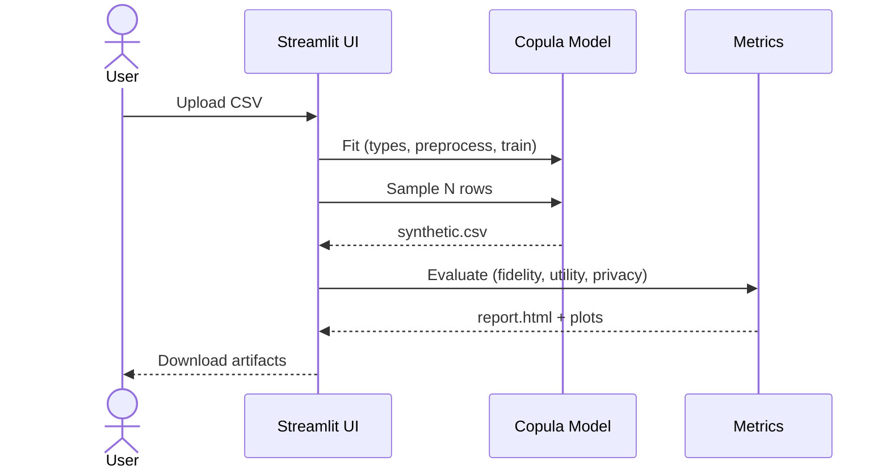
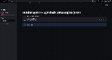
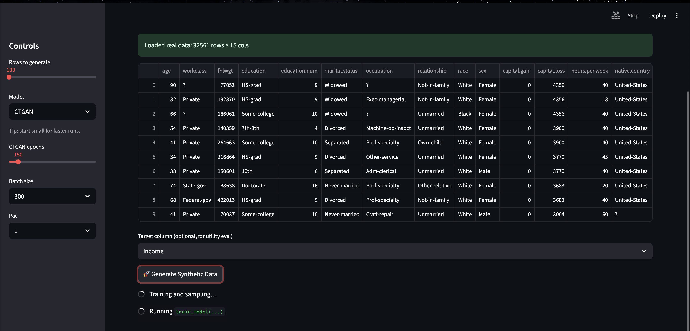
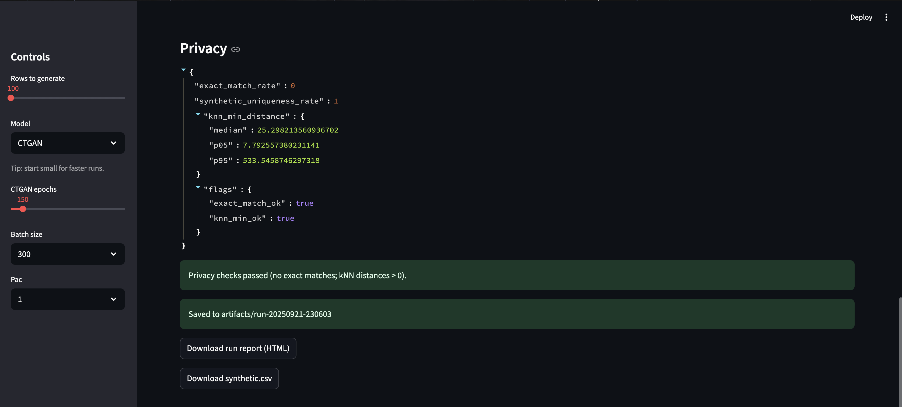
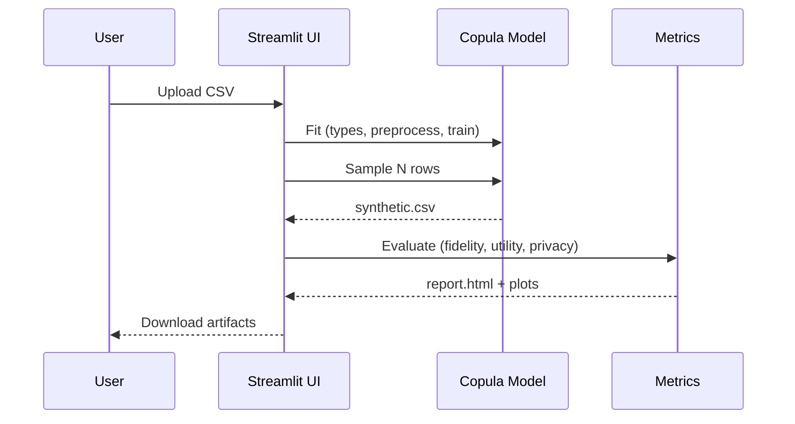

# Tabular Synth (Synthetic Data Engine)

> **Generate privacy‑preserving tabular datasets** from a real CSV, evaluate fidelity/utility/privacy, and export reports — all from a clean Streamlit UI or Docker.

---

## TL;DR
- **Upload CSV → Train copula model → Generate synthetic rows → Evaluate → Download**
- Outputs land in `artifacts/run-YYYYmmdd-HHMMSS/` with `synthetic.csv` and `report.html`.
- Designed for **reproducibility** and **explainability**, with a focus on **tabular** data.

---

## Why this project?
Real tabular data is often **sensitive**, **siloed**, or **hard to share**. Synthetic data lets you:
- **Prototype safely** without exposing PII/PHI.
- **Unblock analytics** when access to the original dataset is restricted.
- **Stress‑test pipelines** using shape‑compatible datasets.

**Why copulas?**
- Copulas **separate marginals from dependence structure**, making them a good fit for tabular data with mixed types.
- They are **interpretable** and **fast to train**, making them a strong baseline against heavier GAN/VAEs for many datasets.

> Roadmap includes plug‑in generators (e.g., CTGAN/TVAE) for A/B comparisons.

---

## System overview



**Key modules**
- `core/schema.py` — column typing, constraints
- `core/copula.py` — copula fit/sampling
- `core/metrics/` — fidelity, utility, privacy checks
- `ui/streamlit_app.py` — interactive front‑end

---

## Features
- **One‑click training** of a copula‑based generator from a CSV
- **Deterministic runs** with `--seed` for reproducibility
- **Fidelity metrics**: per‑column drift (e.g., JS/KS), pairwise correlation deltas
- **Utility metrics**: TSTR (Train‑on‑Synth, Test‑on‑Real) for a chosen target
- **Privacy heuristics**: nearest‑neighbor uniqueness, outlier disclosure risk
- **Exportable HTML report** consolidating all metrics + plots

> Privacy metrics are **heuristics** and **not** a guarantee of anonymity. See **Limitations** below.

---

## Demo 



---

## Quickstart

### Option A — Docker
```bash
docker build -t tabular-synth:latest .
docker run -p 8501:8501 -v "$(pwd)/artifacts:/app/artifacts" tabular-synth:latest
# open http://localhost:8501
```

### Option B — Local (Python 3.11+)
```bash
python -m venv .venv && source .venv/bin/activate
pip install -r requirements.txt
streamlit run ui/streamlit_app.py
```

All outputs are saved to timestamped folders under `artifacts/`.

```text
artifacts/
└── run-YYYYmmdd-HHMMSS/
    ├── synthetic.csv      # generated dataset
    └── report.html        # fidelity + utility + privacy summary
```

---

## Example walkthrough

1) **Upload** a CSV with headers and a few thousand rows.
2) **Schema & constraints** are inferred; adjust types if needed.
3) **Train** the copula model (seeded for reproducibility).
4) **Generate** `N` rows and download `synthetic.csv`.
5) **Evaluate** (auto‑runs):
   - **Fidelity**: compare real vs. synthetic marginals and correlations.
   - **Utility**: run TSTR for a selected target (classification/regression).
   - **Privacy**: nearest neighbor distance & uniqueness checks.
6) **Export** `report.html` (screenshots below).

> Tip: Try small `N` first to validate schema; then scale up.

---

## 📈 Metrics at a glance

| Category  | What we check | Examples in report |
|-----------|----------------|--------------------|
| Fidelity  | Column drift, pairwise correlation deltas | histograms, QQ plots, heatmaps |
| Utility   | TSTR: ML model trained on synthetic, tested on real | ROC/PR, MAE/RMSE, feature importances |
| Privacy   | Rarest‑neighbor distance, outlier disclosure risk | distance histograms, high‑risk flags |

> Configure thresholds in `config/metrics.yaml`.

---

## Tech stack
- **Python** (3.11+), **Streamlit** UI
- **NumPy/Pandas/Scikit‑learn** for EDA & TSTR
- **Copula libraries** (e.g., Gaussian/Vine copulas)
- **PyTest** for CI checks
- **Docker** for reproducible runtime

---

## Project structure
```text
.
├── core/
│   ├── schema.py
│   ├── copula.py
│   └── metrics/
│       ├── fidelity.py
│       ├── utility.py
│       └── privacy.py
├── ui/
│   └── streamlit_app.py
├── config/
│   └── metrics.yaml
├── tests/
│   └── test_basic.py
├── artifacts/            # outputs (gitignored)
├── assets/               # README images (committed)
├── Dockerfile
├── requirements.txt
└── README.md
```

---

## CI (GitHub Actions)

```yaml
name: ci
on: [push, pull_request]
jobs:
  test:
    runs-on: ubuntu-latest
    steps:
      - uses: actions/checkout@v4
      - uses: actions/setup-python@v5
        with:
          python-version: '3.11'
      - run: pip install -r requirements.txt pytest
      - run: pytest -q
```

<details>
<summary>Optional: add lint & type checks</summary>

```yaml
      - run: pip install ruff mypy
      - run: ruff check .
      - run: mypy . --ignore-missing-imports
```
</details>

---

## Screenshots
<p align="center">
  
</p>

<p align="center">
  
</p>

---

## Architecture & flow



---

## Limitations
- Copulas can struggle with **high‑cardinality categoricals** and **non‑linear** interactions.
- **Privacy metrics are heuristic**; use additional governance (e.g., DCRs, expert review) for real deployments.
- TSTR depends on **target selection** and **model choice**.

---

## Roadmap
- Plug‑in generators: **CTGAN**, **TVAE** for comparisons
- Constraint support (e.g., value ranges, cross‑column rules)
- Automatic **feature type repair** for dirty schemas
- Richer privacy diagnostics (MIA probes, attribute inference tests)

---

## Contributing
PRs welcome! Please run `pytest -q` before submitting.

---

## References
- Nelsen, *An Introduction to Copulas*
- Sklar’s Theorem (dependence modeling)
- TSTR protocol for evaluating synthetic data

---

## License
MIT (see `LICENSE`).
